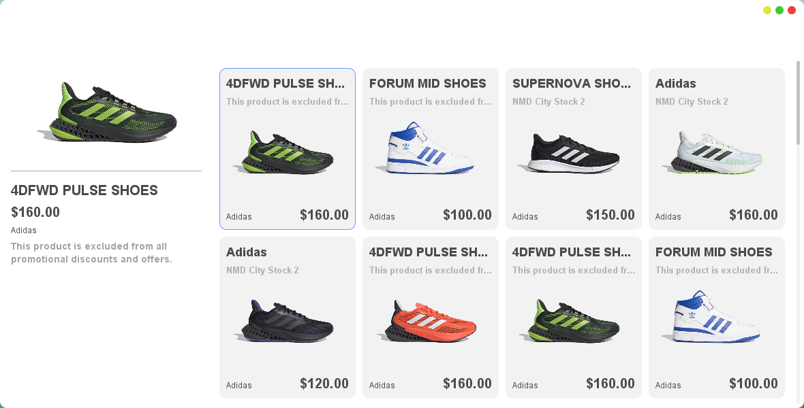

<p align="justify">
## 1. Đề bài
Yêu cầu:
- Sử dụng Java Swing/JavaFX Thiết kế một website bán sản phẩm có bố cục như hình mẫu (8 điểm). 
- Thêm tính năng click chọn một sản phẩm ở trong danh sách các sản phẩm ở phía bên phải sẽ thay đổi sản phẩm được hiển thị ở phía bên trái (1 điểm).
- Thêm hiệu ứng thay đổi sản phẩm được hiển thị ở phía bên trái khi chọn vào một sản phẩm trong danh sách các sản phẩm ở phía bên phải (1 điểm).



## 2. So sánh giữa Java Swing và JavaFX
Đầu tiên thì mình sẽ so sánh giữa 2 thư viện này nhé:
| Tiêu chí            | Java Swing             | JavaFX                           |
| ------------------- | ---------------------- | -------------------------------- |
| Ra đời              | Trước (từ Java 1.2)    | Sau (Java 8 chính thức tích hợp) |
| Hỗ trợ CSS          | Không                  | Có (dùng CSS để style)           |
| Hiệu ứng, Animation | Giới hạn               | Có hỗ trợ hiệu ứng, animation    |
| UI hiện đại         | Khá cổ điển            | Giao diện đẹp, hiện đại hơn      |
| Học dễ không?       | Dễ học, nhiều tài liệu | Khó hơn chút nhưng tiềm năng lớn |

JavaFX tuy khó học hơn đôi chút nhưng lại có nhiều ưu điểm hơn Java Swing. Vì thế trong BTTH3, mình sẽ sử dụng JavaFX để thiết kế giao diện website. 

Yah, bắt đầu thôi nào!✨✨✨

## 3. Thiết kế giao diện bằng JavaFX

### Cấu trúc thư mục chuẩn Maven
Để dễ dàng quản lý và build project, mình tổ chức thư mục theo cấu trúc chuẩn Maven như sau:

```
BTTH_IE303.P22/
├── pom.xml
└── src/
    └── main/
        ├── java/
        │   ├── MainApp.java
        │   ├── Product.java
        │   └── ProductData.java
        └── resources/
            ├── img1.png
            ├── img2.png
            ├── img3.png
            ├── img4.png
            ├── img5.png
            └── img6.png
```

### Cấu hình Maven (pom.xml)
Mình sẽ tạo file `pom.xml` ở thư mục gốc để khai báo và cấu hình các thư viện JavaFX cần thiết như sau:

```xml
<project xmlns="http://maven.apache.org/POM/4.0.0"
         xmlns:xsi="http://www.w3.org/2001/XMLSchema-instance"
         xsi:schemaLocation="http://maven.apache.org/POM/4.0.0 http://maven.apache.org/xsd/maven-4.0.0.xsd">
    <modelVersion>4.0.0</modelVersion>

    <groupId>com.example</groupId>
    <artifactId>javafx-shop</artifactId>
    <version>1.0-SNAPSHOT</version>

    <properties>
        <project.build.sourceEncoding>UTF-8</project.build.sourceEncoding>
        <javafx.version>21</javafx.version>
        <maven.compiler.source>17</maven.compiler.source>
        <maven.compiler.target>17</maven.compiler.target>
    </properties>

    <dependencies>
        <dependency>
            <groupId>org.openjfx</groupId>
            <artifactId>javafx-controls</artifactId>
            <version>${javafx.version}</version>
        </dependency>
        <dependency>
            <groupId>org.openjfx</groupId>
            <artifactId>javafx-fxml</artifactId>
            <version>${javafx.version}</version>
        </dependency>
    </dependencies>

    <build>
        <plugins>
            <plugin>
                <groupId>org.openjfx</groupId>
                <artifactId>javafx-maven-plugin</artifactId>
                <version>0.0.8</version>
                <configuration>
                    <mainClass>MainApp</mainClass>
                </configuration>
            </plugin>
        </plugins>
    </build>
</project>
```
Sau đó, mở terminal tại thư mục gốc và chạy lệnh sau để Maven tự động tải các dependency đã khai báo:
   ```
   mvn clean install
   ```

> Như vậy, ở bước trên mình đã tải thư viện Java FX thành công, bây giờ mình sẽ bắt đầu vào phần code.

### Quy trình code các file Java
1. **Product.java**: Đầu tiên, chúng ta cần tạo lớp `Product` để lưu thông tin sản phẩm (tên, giá, hãng, mô tả, đường dẫn ảnh). Lớp này sẽ được dùng để tạo các đối tượng sản phẩm trong ứng dụng.
Lớp này có:
- Một constructor để khởi tạo sản phẩm với đầy đủ thông tin
- Các phương thức getter (getName, getBrand, getDescription, getPrice, getImagePath) để lấy thông tin của sản phẩm
```java
public class Product {
    private String name;
    private String brand;
    private String description;
    private double price;
    private String imagePath;

    public Product(String name, String brand, String description, double price, String imagePath) {
        this.name = name;
        this.brand = brand;
        this.description = description;
        this.price = price;
        this.imagePath = imagePath;
    }

    public String getName() {
        return name;
    }

    public String getBrand() {
        return brand;
    }

    public String getDescription() {
        return description;
    }

    public double getPrice() {
        return price;
    }

    public String getImagePath() {
        return imagePath;
    }
}
```
2. **ProductData.java**: Tiếp theo, tạo lớp `ProductData` để trả về danh sách các sản phẩm mẫu. Lớp này chứa dữ liệu mẫu cho ứng dụng. 
- Phương thức `getSampleProducts` để trả về danh sách các sản phẩm mẫu
- Sử dụng `Array.asList()` để tạo danh sách 8 sản phẩm mẫu
```java
import java.util.List;
import java.util.Arrays;

public class ProductData {
        public static List<Product> getSampleProducts() {
                return Arrays.asList(
                                new Product("4DFWD PULSE SHOES", "Adidas",
                                                "This product is excluded from all promotional discounts 
                                                and offers.",
                                                160.0, "img1.png"),
                                new Product("FORUM MID SHOES", "Adidas",
                                                "This product is excluded from all promotional discounts 
                                                and offers.",
                                                100.0, "img2.png"),
                                new Product("SUPERNOVA SHOES", "Adidas", "NMD City Stock 2", 
                                                150.0, "img3.png"),
                                new Product("ADIDAS SHOES", "Adidas", "NMD City Stock 2", 
                                                160.0, "img4.png"),
                                new Product("SUBA SHOES", "Adidas", "NMD City Stock 2", 
                                                120.0, "img5.png"),
                                new Product("4DFWD PULSE 2 SHOES", "Adidas", "NMD City Stock 2", 
                                                160.0, "img6.png"),
                                new Product("OZWEEGO", "Adidas", "Retro-inspired shoes with 
                                                modern comfort.", 135.0, "img2.png"),
                                new Product("NMD_R1", "Adidas", "Urban style shoes with Boost cushioning.", 
                                                175.0, "img5.png"));
        }
}
```
3. **MainApp.java**: Cuối cùng, tạo lớp `MainApp` để thiết kế giao diện JavaFX. Lớp này sẽ sử dụng `ProductData` để lấy danh sách sản phẩm, hiển thị sản phẩm lớn bên trái và danh sách sản phẩm nhỏ bên phải. Khi click vào sản phẩm nhỏ, sản phẩm lớn sẽ thay đổi với hiệu ứng.

### Chi tiết về MainApp.java

#### 1. Các import và khai báo biến
```java
import javafx.application.Application;
import javafx.geometry.Insets;
import javafx.geometry.Pos;
import javafx.scene.Scene;
import javafx.scene.control.Label;
import javafx.scene.control.ScrollPane;
import javafx.scene.effect.DropShadow;
import javafx.scene.image.Image;
import javafx.scene.image.ImageView;
import javafx.scene.input.MouseEvent;
import javafx.scene.layout.*;
import javafx.scene.paint.Color;
import javafx.scene.shape.Line;
import javafx.scene.text.Font;
import javafx.scene.text.FontWeight;
import javafx.stage.Stage;
import javafx.animation.FadeTransition;
import javafx.util.Duration;
import java.util.List;
import javafx.scene.control.Tooltip;

public class MainApp extends Application {
    private VBox leftPane;           // Panel bên trái chứa sản phẩm được chọn
    private ImageView mainImageView; // Hiển thị ảnh sản phẩm chính
    private Label nameLabel, priceLabel, brandLabel, descLabel; // Các label hiển thị thông tin
    private Product currentProduct;  // Sản phẩm đang được hiển thị
    private VBox selectedBox = null; // Sản phẩm được chọn bên panel phải
}
```

#### 2. Phương thức start() - Khởi tạo giao diện chính
```java
@Override
public void start(Stage primaryStage) {
    List<Product> products = ProductData.getSampleProducts();

    BorderPane root = new BorderPane();
    root.setPadding(new Insets(20));
    root.setStyle("-fx-background-color: #fff;");

    // LEFT: Hiển thị sản phẩm lớn
    leftPane = new VBox();
    leftPane.setPadding(new Insets(10));
    leftPane.setAlignment(Pos.CENTER_LEFT);
    leftPane.setPrefWidth(300);
    leftPane.setStyle("-fx-background-color: #fff; -fx-focus-color: transparent; -fx-faint-focus-color: 
    transparent;");
    leftPane.setFocusTraversable(false);

    // Tạo layout cho phần hiển thị sản phẩm chính
    VBox centerBox = new VBox();
    centerBox.setAlignment(Pos.TOP_CENTER);
    centerBox.setSpacing(8);
    centerBox.setPrefHeight(Region.USE_COMPUTED_SIZE);
    centerBox.setPadding(new Insets(0, 0, 0, 0));

    // Thiết lập ảnh sản phẩm chính
    mainImageView = new ImageView();
    mainImageView.setFitWidth(250);
    mainImageView.setFitHeight(1500);
    mainImageView.setPreserveRatio(true);
    mainImageView.setEffect(new DropShadow(10, Color.rgb(180, 180, 180, 0.3)));

    // Tạo đường kẻ phân cách
    Line line = new Line(0, 0, 260, 0);
    line.setStroke(Color.web("#cccccc"));
    line.setStrokeWidth(1.2);
    line.setTranslateY(0);

    // Thiết lập các label thông tin
    nameLabel = new Label();
    nameLabel.setFont(Font.font("Arial", FontWeight.BOLD, 22));
    priceLabel = new Label();
    priceLabel.setFont(Font.font("Arial", FontWeight.BOLD, 20));
    brandLabel = new Label();
    brandLabel.setFont(Font.font("Arial", FontWeight.NORMAL, 16));
    descLabel = new Label();
    descLabel.setFont(Font.font("Arial", FontWeight.NORMAL, 14));
    descLabel.setWrapText(true);
    descLabel.setTextFill(Color.GRAY);

    // Thêm các thành phần vào layout
    VBox infoBox = new VBox(8, nameLabel, priceLabel, brandLabel, descLabel);
    infoBox.setAlignment(Pos.TOP_LEFT);
    infoBox.setPadding(new Insets(5, 0, 0, 0));

    centerBox.getChildren().addAll(imgBox, line, infoBox);
    leftPane.getChildren().add(centerBox);
    root.setLeft(leftPane);

    // RIGHT: Danh sách sản phẩm nhỏ
    GridPane grid = new GridPane();
    grid.setHgap(18);
    grid.setVgap(18);
    grid.setPadding(new Insets(70, 24, 24, 24));
    
    // Tạo grid 4 cột cho các sản phẩm
    int col = 0, row = 0;
    for (Product p : products) {
        VBox item = createProductItem(p);
        grid.add(item, col, row);
        col++;
        if (col == 4) {
            col = 0;
            row++;
        }
    }

    // Thêm ScrollPane để có thể cuộn
    ScrollPane scrollPane = new ScrollPane(grid);
    scrollPane.setFitToWidth(true);
    scrollPane.setPrefWidth(600);
    scrollPane.setStyle("-fx-background: #fff; -fx-background-color: transparent; 
    -fx-focus-color: transparent; -fx-faint-focus-color: transparent;");    
    scrollPane.setFocusTraversable(false);
    root.setCenter(scrollPane);

    // Hiển thị sản phẩm đầu tiên và đặt hiệu ứng chọn
    showProduct(products.get(0), false);
    VBox firstBox = (VBox) grid.getChildren().get(0);
    firstBox.setStyle("-fx-background-color: #e0e7ef; -fx-border-color: #3b82f6; 
    -fx-border-radius: 8; -fx-background-radius: 8;");
    selectedBox = firstBox;

    Scene scene = new Scene(root, 1100, 650);
    primaryStage.setTitle("Product Shop JavaFX");
    primaryStage.setScene(scene);
    primaryStage.show();
}
```

#### 3. Tạo Item Sản phẩm (createProductItem)
```java
private VBox createProductItem(Product p) {
    VBox box = new VBox(6);
    box.setPadding(new Insets(8));
    box.setAlignment(Pos.TOP_LEFT);
    box.setPrefWidth(180);
    box.setStyle("-fx-background-color: #f3f4f6; -fx-border-color: #e0e0e0; 
    -fx-border-radius: 8; -fx-background-radius: 8;");

    // Tạo các label thông tin sản phẩm
    Label name = new Label(p.getName());
    name.setFont(Font.font("Arial", FontWeight.BOLD, 14));
    name.setWrapText(false);
    name.setMaxWidth(160);
    name.setEllipsisString("...");
    name.setTooltip(new Tooltip(p.getName()));

    Label desc = new Label(p.getDescription());
    desc.setFont(Font.font("Arial", FontWeight.NORMAL, 11));
    desc.setTextFill(Color.web("#b0b0b0"));
    desc.setWrapText(false);
    desc.setMaxWidth(160);
    desc.setEllipsisString("...");
    desc.setTooltip(new Tooltip(p.getDescription()));

    // Thiết lập ảnh sản phẩm
    ImageView img = new ImageView(new Image(p.getImagePath()));
    img.setFitWidth(160);
    img.setFitHeight(120);
    img.setPreserveRatio(true);

    // Tạo layout cho thông tin giá và thương hiệu
    Label brand = new Label(p.getBrand());
    brand.setFont(Font.font("Arial", FontWeight.NORMAL, 12));

    Label price = new Label(String.format("$%.2f", p.getPrice()));
    price.setFont(Font.font("Arial", FontWeight.BOLD, 16));
    price.setTextFill(Color.DIMGRAY);

    Region spacer = new Region();
    HBox.setHgrow(spacer, Priority.ALWAYS);

    HBox bottomBox = new HBox(brand, spacer, price);
    bottomBox.setAlignment(Pos.CENTER_LEFT);

    // Căn giữa ảnh sản phẩm
    HBox imgBox = new HBox(img);
    imgBox.setAlignment(Pos.CENTER);
    imgBox.setPrefWidth(200);

    box.getChildren().addAll(name, desc, imgBox, bottomBox);

    // Thêm các sự kiện hover và click
    box.setOnMouseClicked((MouseEvent e) -> {
        showProduct(p, true);
        if (selectedBox != null) {
            selectedBox.setStyle("-fx-background-color: #f3f4f6; -fx-border-color: 
            #e0e0e0; -fx-border-radius: 8; -fx-background-radius: 8;");
        }
        box.setStyle("-fx-background-color: #e0e7ef; -fx-border-color: #3b82f6; 
        -fx-border-radius: 8; -fx-background-radius: 8;");
        selectedBox = box;
    });

    box.setOnMouseEntered(e -> {
        if (box != selectedBox) {
            box.setStyle("-fx-background-color: #e0e7ef; -fx-border-color: 
            #3b82f6; -fx-border-radius: 8; -fx-background-radius: 8;");
        }
    });

    box.setOnMouseExited(e -> {
        if (box != selectedBox) {
            box.setStyle("-fx-background-color: #f3f4f6; -fx-border-color: 
            #e0e0e0; -fx-border-radius: 8; -fx-background-radius: 8;");
        }
    });

    return box;
}
```

#### 4. Hiển thị Sản phẩm (showProduct)
```java
private void showProduct(Product p, boolean isAnimated) {
    currentProduct = p;
    mainImageView.setImage(new Image(p.getImagePath()));
    nameLabel.setText(p.getName());
    priceLabel.setText(String.format("$%.2f", p.getPrice()));
    brandLabel.setText(p.getBrand());
    descLabel.setText(p.getDescription());
    
    if (isAnimated) {
        FadeTransition ft = new FadeTransition(Duration.millis(350), leftPane);
        ft.setFromValue(0.2);
        ft.setToValue(1.0);
        ft.play();
    }
}
```

#### 5. Phương thức main
```java
public static void main(String[] args) {
    launch(args);
}
```

### Các tính năng chính của ứng dụng:
1. Hiển thị sản phẩm lớn bên trái với đầy đủ thông tin và hiệu ứng shadow
2. Hiển thị danh sách sản phẩm nhỏ bên phải dạng grid 4 cột
3. Có hiệu ứng hover và click cho các sản phẩm
4. Có hiệu ứng fade khi chuyển đổi sản phẩm
5. Có thể cuộn danh sách sản phẩm bên phải
6. Giao diện được thiết kế đẹp với các hiệu ứng shadow, border radius và màu sắc hài hòa
7. Có tooltip hiển thị đầy đủ thông tin khi hover vào tên và mô tả sản phẩm
8. Tự động cắt text dài với dấu "..." và tooltip hiển thị nội dung đầy đủ

## 4. Chạy ứng dụng
```java
mvn javafx:run
```
**Source Code**: https://github.com/vonhatphuongahihi/BTTH_IE303.P22/tree/BTTH3
</p>

<p align="center">
**Võ Nhất Phương** hoàn thành✨✨✨
</p>