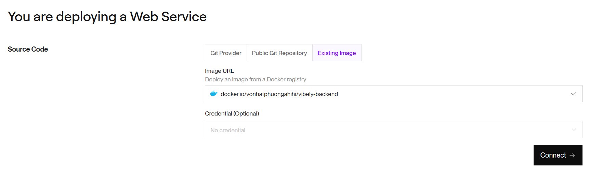
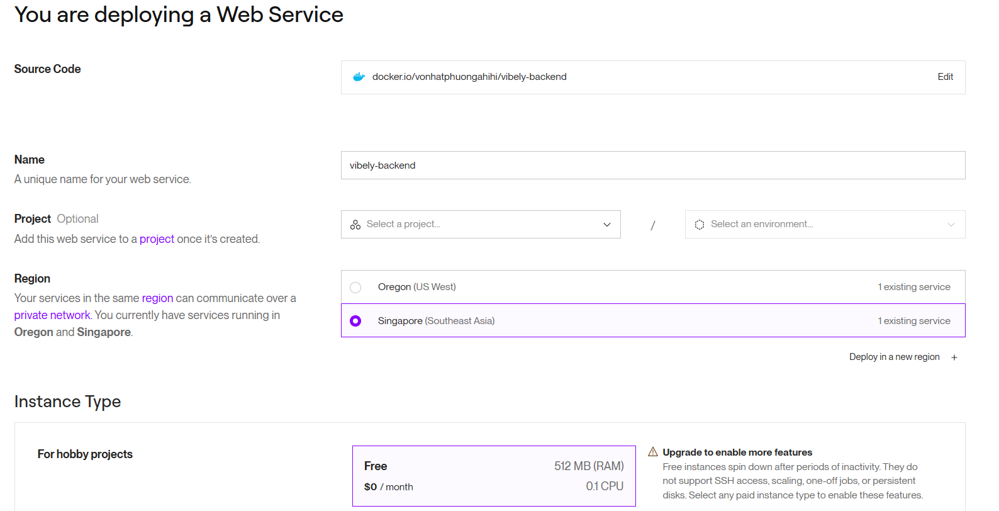
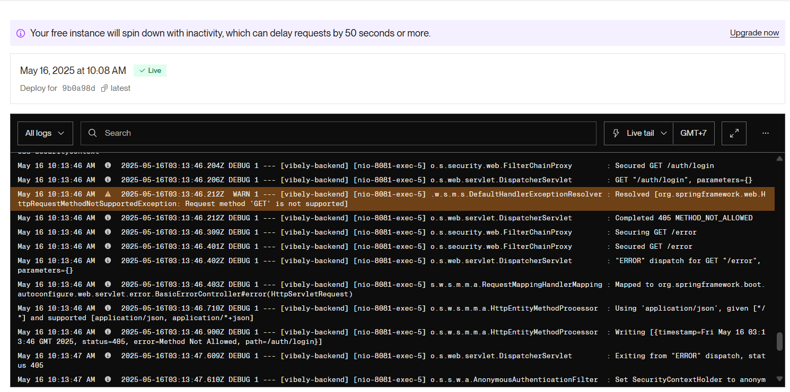

Render hỗ trợ deploy ứng dụng web Java (như Spring Boot) thông qua Docker.

## 1. Build file `.jar`
<p align="justify">
Trước tiên, trong thư mục project, mở terminal và chạy lệnh:
```
./mvnw clean package
```
Sau khi chạy xong, bạn sẽ thấy file `.jar` trong thư mục `target/`. ví dụ:
```
target/vibely-backend-0.0.1-SNAPSHOT.jar
```
</p>

## 2. Tạo Dockerfile
<p align="justify">
Tạo file có tên `Dockerfile` trong thư mục gốc của project với nội dung:
```dockerfile
# Sử dụng image Java chính thức
FROM eclipse-temurin:18-jdk-alpine

# Tạo thư mục app
WORKDIR /app

# Copy file jar đã build vào image
COPY target/*.jar app.jar

# Copy file .env
COPY .env .env

# Expose port 
EXPOSE 8081

# Lệnh chạy ứng dụng
ENTRYPOINT ["java", "-jar", "app.jar"]
```
</p>

## 3. Build Docker Image
<p align="justify">
Chạy lệnh sau để build Docker image:
```bash
docker build -t vibely-backend:latest .
```
</p>

## 4. Push Docker Image lên Docker Hub
<p align="justify">
1. Đăng nhập vào Docker Hub:
```bash
docker login
```

2. Tag image với username Docker Hub của bạn:
```bash
docker tag vibely-backend:latest your-dockerhub-username/vibely-backend:latest
```

3. Push image lên Docker Hub:
```bash
docker push your-dockerhub-username/vibely-backend:latest
```
</p>

## 5. Push toàn bộ mã nguồn lên GitHub
<p align="justify">
Các file cần có:
- Toàn bộ mã nguồn
- pom.xml
- Dockerfile
- (khuyến khích có) README.md

Dùng các lệnh sau nếu chưa đẩy:
```
git init
git add .
git commit -m "Initial commit"
git branch -M main
git remote add origin https://github.com/your-username/your-repo.git
git push -u origin main
```
</p>

## 6. Deploy lên Render
<p align="justify">
1. Vào trang: https://render.com/
2. Đăng nhập → Chọn Add New -> Web Service
3. Trong phần chọn Source Code, chọn Existing Image và click Connect:



4. Chọn các tùy chọn Deploy và click Deploy Web Service:



</p>

## 7. Kiểm tra
<p align="justify">
- Sau khi deploy thành công, Render sẽ cung cấp cho chúng ta một URL


- Truy cập URL này để kiểm tra ứng dụng
- Kiểm tra logs trong dashboard của Render nếu có lỗi
</p>

<p align="center">
**Võ Nhất Phương** hoàn thành✨✨✨.
</p>