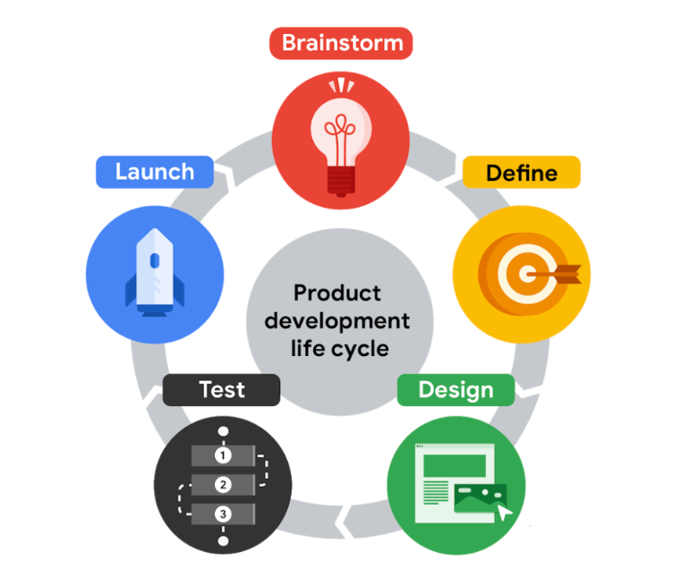
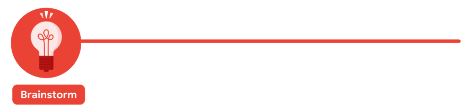
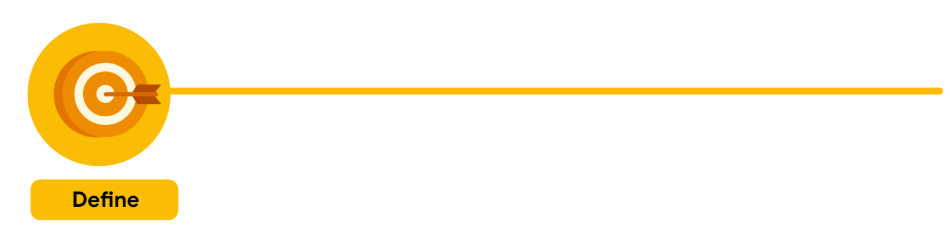
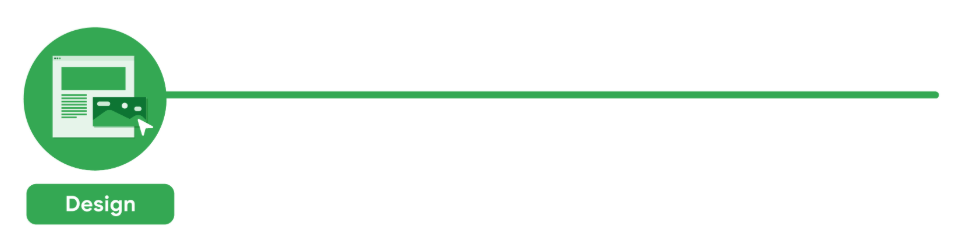
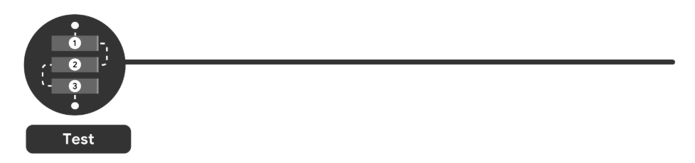
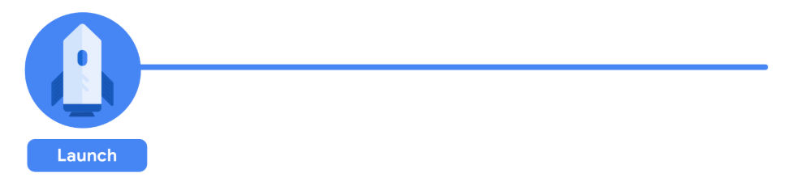

# Nền Tảng Của Thiết Kế Trải Nghiệm Người Dùng (UX) (P1)

Thiết kế trải nghiệm người dùng (UX Design) đang trở thành một yếu tố không thể thiếu trong việc phát triển sản phẩm số hiện đại. Hãy cùng tìm hiểu về những nguyên tắc cơ bản và tầm quan trọng của UX Design trong việc tạo ra những trải nghiệm tuyệt vời cho người dùng!

## 1. UX Design là gì?

Thiết kế trải nghiệm người dùng (UX Design) là quá trình xây dựng và tối ưu hóa sản phẩm, dịch vụ hoặc hệ thống nhằm mang đến trải nghiệm ý nghĩa, dễ sử dụng và phù hợp với nhu cầu của người dùng. UX Design không chỉ tập trung vào giao diện mà còn bao gồm toàn bộ hành trình người dùng — từ lúc tiếp cận, sử dụng đến cảm nhận sau khi trải nghiệm sản phẩm.

### Các thành phần chính
- **Mục tiêu người dùng**: Tìm hiểu nhu cầu, kỳ vọng và mục tiêu mà người dùng muốn đạt được.
- **Quy trình sử dụng**:Các bước mà người dùng phải thực hiện để hoàn thành mục tiêu một cách thuận tiện và hiệu quả.
- **Tương tác**: Cách người dùng tương tác với hệ thống qua các hành động như chạm, nhấp, kéo thả,...
- **Giao diện**: Giao diện trực quan, thân thiện, phản hồi nhanh giúp người dùng dễ dàng thao tác và cảm thấy thoải mái khi sử dụng.

### Tầm quan trọng
1. **Tăng sự hài lòng của người dùng**: Một trải nghiệm tốt sẽ khiến người dùng quay lại và giới thiệu cho người khác.
2. **Tiết kiệm chi phí phát triển**: Giảm thiểu lỗi trong quá trình sử dụng và giảm nhu cầu hỗ trợ kỹ thuật.
3. **Nâng cao hiệu suất sử dụng**: Người dùng dễ dàng hoàn thành nhiệm vụ với ít thời gian và công sức hơn.
4. **Tạo dựng thương hiệu mạnh**: Một sản phẩm có UX tốt sẽ góp phần xây dựng hình ảnh tích cực, chuyên nghiệp cho doanh nghiệp.

## 2. Vòng đời phát triển sản phẩm?
Có năm giai đoạn: động não, xác định, thiết kế, thử nghiệm và ra mắt.

### Động não
Giai đoạn đầu tiên trong vòng đời phát triển sản phẩm là giai đoạn động não, khi nhóm bắt đầu suy nghĩ về ý tưởng sản phẩm bằng cách xác định những vấn đề mà người dùng đang gặp phải. 
Nếu đã biết trước vấn đề, nhóm có thể tập trung ngay vào giải pháp; còn nếu chưa, việc lập danh sách các khó khăn của người dùng là một điểm khởi đầu tốt. 
Ở giai đoạn này, sự đa dạng trong nhóm – về chủng tộc, giới tính, độ tuổi, khả năng, văn hóa,... – đóng vai trò quan trọng, bởi nó mang lại nhiều góc nhìn và trải nghiệm sống khác nhau, giúp quá trình động não phong phú hơn. 

Ví dụ, nếu nhóm đang thiết kế một ứng dụng hỗ trợ phụ huynh đang đi làm, có thể bắt đầu bằng cách liệt kê những khó khăn phổ biến như thiếu dịch vụ giữ trẻ uy tín, bất tiện trong việc đưa đón con hoặc khó quản lý thời gian. Nhóm cũng nên tham khảo phản hồi từ người dùng, kết quả khảo sát và nghiên cứu đối thủ cạnh tranh để đảm bảo sản phẩm giải quyết được vấn đề một cách khác biệt và hiệu quả hơn các giải pháp hiện có.

### Xác định sản phẩm
Mục tiêu là tìm ra thông số kỹ thuật cho sản phẩm bằng cách trả lời các câu hỏi như: Sản phẩm dành cho ai? Sản phẩm sẽ làm gì? Và, những tính năng nào cần được bao gồm để sản phẩm thành công? 

### Thiết kế
Ở giai đoạn này, các nhà thiết kế UX phát triển các ý tưởng cho sản phẩm. Vẽ wireframe, phác thảo của sản phẩm, sau đó chuyển sang tạo các nguyên mẫu, là những mô hình ban đầu của một sản phẩm truyền tải chức năng của nó. 

Tại thời điểm này trong vòng đời, các nhà thiết kế UX đảm bảo bao gồm tất cả các thông số kỹ thuật sản phẩm đã được nêu trong giai đoạn xác định. Bạn cũng có thể kiểm tra để đảm bảo rằng mỗi phần của thiết kế phù hợp với nhau một cách trực quan. 

Ví dụ: các nhà thiết kế UX có thể kiểm tra xem màn hình của ứng dụng có hoạt động theo cách có ý nghĩa đối với người dùng hay không. Hoặc mỗi tương tác, như chạm vào một nút, có một hành động tương quan, giống như một mặt hàng được thêm vào giỏ hàng. Mặt khác, với một sản phẩm vật lý, các nhà thiết kế UX có thể kiểm tra xem một phần của một đối tượng vật lý có khớp với phần kết nối hay không. Cuối cùng, các nhà thiết kế UX cũng đảm bảo rằng mỗi nhiệm vụ mà người dùng cần hoàn thành đều rõ ràng và dễ hiểu, như điều hướng từ trang chủ đến trang xác nhận thanh toán trong một ứng dụng.

### Thử nghiệm
Các nhà thiết kế UX làm việc với các kỹ sư để phát triển các nguyên mẫu chức năng phù hợp với thiết kế ban đầu, bao gồm các chi tiết và tính năng phù hợp với thương hiệu của công ty, như lựa chọn phông chữ và màu sắc. Điều này cũng có nghĩa là viết mã và hoàn thiện cấu trúc tổng thể của sản phẩm. 
- Đầu tiên, nhóm kiểm tra sản phẩm trong nội bộ để tìm kiếm các trục trặc kỹ thuật và các vấn đề về khả năng sử dụng. Điều này thường được gọi là thử nghiệm alpha. 
- Sau đó, sản phẩm trải qua thử nghiệm với các bên liên quan để đảm bảo sản phẩm phù hợp với tầm nhìn của công ty, đáp ứng các hướng dẫn pháp lý về khả năng tiếp cận và tuân theo các quy định của chính phủ về quyền riêng tư chẳng hạn. 
- Cuối cùng, có một thử nghiệm bên ngoài với người dùng tiềm năng. Đây là thời điểm để tìm hiểu xem sản phẩm có cung cấp trải nghiệm người dùng tốt hay không, có nghĩa là nó có thể sử dụng được, công bằng, thú vị và hữu ích. Điều này thường được gọi là thử nghiệm beta.

### Ra mắt
Đưa ứng dụng lên Cửa hàng Google Play hoặc App Store của Apple, làm cho trang web hoạt động hoặc đưa sản phẩm vật lý lên kệ cửa hàng. 

Đối với một sản phẩm vật lý, giai đoạn ra mắt có thể là kết thúc vòng đời phát triển sản phẩm. Nhưng đối với một sản phẩm kỹ thuật số, như một ứng dụng hoặc trang web, việc tung sản phẩm đến nhiều đối tượng hơn cung cấp một cơ hội khác để cải thiện trải nghiệm người dùng. Người dùng mới có thể tìm thấy sự cố với chức năng hoặc tính năng của sản phẩm để cải thiện mà chưa ai nhận thấy trước đây. Vì vậy, sau giai đoạn ra mắt, các nhóm thường sẽ quay trở lại giai đoạn thiết kế và thử nghiệm để bắt đầu làm việc trên phiên bản tiếp theo của sản phẩm kỹ thuật số.

---

**Võ Nhất Phương** hoàn thành✨✨✨

