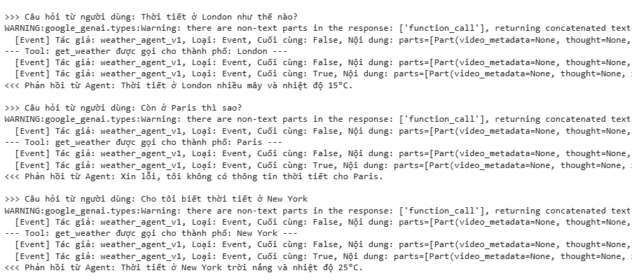

# Xây Dựng Hệ Thống Đa Agent Thông Minh với Google ADK: Weather Bot Đa Tác Nhân (P1)
<p align="justify">
🌤️ Chúng ta sẽ xây dựng một “Weather Bot” với nhiều agent phối hợp. Bắt đầu từ một agent đơn giản có thể tra cứu thời tiết, mình sẽ từng bước bổ sung các tính năng nâng cao như:
- **Tool Definition**: Định nghĩa các hàm Python làm "năng lực" cho agent
- **Multi-Model (LiteLLM)**: Sử dụng nhiều LLM (Gemini, GPT, Claude) trong cùng hệ thống
- **Agent Delegation**: Tạo sub-agent để xử lý riêng từng loại câu hỏi
- **Session State**: Giúp agent ghi nhớ thông tin trong quá trình trò chuyện
- **Callbacks**: Thêm lớp an toàn trước khi gửi yêu cầu tới model/tool

## 0. Step 0: Cài đặt môi trường & Cấu hình API Keys
Cài đặt các thư viện cần thiết và cấu hình các khóa API để sử dụng mô hình LLM từ Google, OpenAI hoặc Anthropic.

**Cài đặt ADK và LiteLLM**

```
!pip install google-adk -q
!pip install litellm -q
```
LiteLLM là một thư viện Python giúp dễ dàng tích hợp và sử dụng nhiều mô hình ngôn ngữ lớn (LLMs) khác nhau trong cùng một ứng dụng mà không phải lo về chi tiết từng API riêng biêt.

LiteLLM là cầu nối đa mô hình, hỗ trợ gọi các LLM của nhiều nhà cung cấp như Google Gemini, OpenAI GPT, Anthropic Claude... qua một giao diện thống nhất và đơn giản.

**Import các thư viện cần thiết**
```
import os
import asyncio
from google.adk.agents import Agent
from google.adk.models.lite_llm import LiteLlm
from google.adk.sessions import InMemorySessionService
from google.adk.runners import Runner
from google.genai import types

import warnings
warnings.filterwarnings("ignore")

import logging
logging.basicConfig(level=logging.ERROR)
```
**Cấu hình API Key**
```
os.environ["GOOGLE_API_KEY"] = "YOUR_GOOGLE_API_KEY"
os.environ["OPENAI_API_KEY"] = "YOUR_OPENAI_API_KEY"
os.environ["ANTHROPIC_API_KEY"] = "YOUR_ANTHROPIC_API_KEY"

# Dùng API trực tiếp, không dùng Vertex AI
os.environ["GOOGLE_GENAI_USE_VERTEXAI"] = "False"
```

**Định nghĩa Model**
```
MODEL_GEMINI_2_0_FLASH = "gemini-2.0-flash"
MODEL_GPT_4O = "openai/gpt-4.1"
MODEL_CLAUDE_SONNET = "anthropic/claude-sonnet-4-20250514" 
```

## 1. Step 1: Tra cứu thời tiết cơ bản
Thực hiện như Blog bài [**Tìm Hiểu Về Agent Development Kit (ADK) - Công Cụ Mới Của Google**](http://localhost:3000/blog/agent-development-kit-beginner)

**Định nghĩa hàm get_weather**
```
def get_weather(city: str) -> dict:
    """Lấy báo cáo thời tiết hiện tại cho một thành phố cụ thể.

    Tham số:
        city (str): Tên thành phố (ví dụ: "New York", "London", "Tokyo").

    Trả về:
        dict: Một từ điển chứa thông tin thời tiết.
              Bao gồm khóa 'status' ('success' hoặc 'error').
              Nếu 'success', có thêm khóa 'report' với chi tiết thời tiết.
              Nếu 'error', có khóa 'error_message' chứa thông báo lỗi.
    """
    print(f"--- Tool: get_weather được gọi cho thành phố: {city} ---")  # Ghi log khi tool được gọi
    city_normalized = city.lower().replace(" ", "")  # Chuẩn hóa tên thành phố đơn giản

    # Dữ liệu thời tiết giả lập
    mock_weather_db = {
        "newyork": {"status": "success", "report": "Thời tiết ở New York nắng, nhiệt độ 25°C."},
        "london": {"status": "success", "report": "Ở London trời nhiều mây, nhiệt độ 15°C."},
        "tokyo": {"status": "success", "report": "Tokyo đang mưa nhẹ, nhiệt độ 18°C."},
    }

    if city_normalized in mock_weather_db:
        return mock_weather_db[city_normalized]
    else:
        return {"status": "error", "error_message": f"Xin lỗi, tôi không có thông tin thời tiết cho '{city}'."}

# Ví dụ sử dụng tool (kiểm tra)
print(get_weather("New York"))
print(get_weather("Paris"))
```
**Định nghĩa Agent (weather_agent)**

Agent đóng vai trò điều phối giữa người dùng, mô hình ngôn ngữ (LLM) và các công cụ (tools) sẵn có.

Khi tạo một agent, cần cấu hình với các tham số quan trọng sau:
- name: Tên định danh duy nhất cho agent này (ví dụ: "weather_agent_v1").
- model: Chỉ định mô hình LLM sẽ sử dụng (ví dụ: MODEL_GEMINI_2_0_FLASH). Trong bước này, chúng ta sẽ bắt đầu với một mô hình Gemini cụ thể.
- description: Mô tả ngắn gọn về mục đích tổng thể của agent. Mô tả này rất quan trọng về sau, khi các agent khác cần quyết định có nên giao nhiệm vụ cho agent này hay không.
- instruction: Hướng dẫn chi tiết cho LLM về cách cư xử, tính cách, mục tiêu và cụ thể là khi nào và cách nào nên dùng các công cụ được giao.
- tools: Một danh sách các hàm Python (tool) mà agent được phép sử dụng (ví dụ: [get_weather]).

```
AGENT_MODEL = MODEL_GEMINI_2_0_FLASH  

weather_agent = Agent(
    name="weather_agent_v1",  
    model=AGENT_MODEL,       
    description="Cung cấp thông tin thời tiết cho các thành phố cụ thể.",
    instruction=(
        "Bạn là một trợ lý thời tiết hữu ích. "
        "Khi người dùng hỏi về thời tiết ở một thành phố cụ thể, "
        "hãy sử dụng công cụ 'get_weather' để tìm thông tin. "
        "Nếu công cụ trả về lỗi, hãy thông báo cho người dùng một cách lịch sự. "
        "Nếu công cụ hoạt động thành công, hãy trình bày báo cáo thời tiết một cách rõ ràng."
    ),
    tools=[get_weather],  
)

print(f"Agent '{weather_agent.name}' đã được tạo với model '{AGENT_MODEL}'.")
```
**Thiết lập Runner và Session Service**

Để quản lý cuộc hội thoại và thực thi agent, ta cần 2 thành phần bổ sung:
- SessionService: Chịu trách nhiệm quản lý lịch sử hội thoại và trạng thái của các người dùng và phiên làm việc khác nhau. InMemorySessionService là một phiên bản đơn giản, lưu trữ toàn bộ dữ liệu trong bộ nhớ — phù hợp để thử nghiệm hoặc ứng dụng nhỏ. Nó sẽ ghi lại toàn bộ tin nhắn giữa người dùng và agent.
- Runner: Đây là “bộ máy điều phối” cho agent. Runner tiếp nhận input từ người dùng, chuyển nó đến agent phù hợp, gọi LLM và tool dựa theo logic của agent, cập nhật phiên hội thoại qua SessionService và phát ra các sự kiện đại diện cho quá trình xử lý.

```
session_service = InMemorySessionService()

APP_NAME = "weather_tutorial_app"
USER_ID = "user_1"
SESSION_ID = "session_001" 

session = await session_service.create_session(
    app_name=APP_NAME,
    user_id=USER_ID,
    session_id=SESSION_ID
)
print(f"Đã tạo session: App='{APP_NAME}', User='{USER_ID}', Session='{SESSION_ID}'")

runner = Runner(
    agent=weather_agent,         
    app_name=APP_NAME,          
    session_service=session_service  
)
print(f"Đã tạo Runner cho agent '{runner.agent.name}'.")
```
**Tương tác với Agent**

Chúng ta cần một cách để gửi tin nhắn tới agent và nhận phản hồi từ nó. Vì việc gọi mô hình ngôn ngữ lớn (LLM) và thực thi các công cụ (tools) có thể mất thời gian, Runner trong ADK hoạt động bất đồng bộ (asynchronous).

Chúng ta sẽ định nghĩa một hàm hỗ trợ async (call_agent_async) với các chức năng:
1. Nhận một chuỗi câu hỏi từ người dùng
2. Đóng gói nó thành định dạng ``Content`` của ADK
3. Gọi ``runner.run_async``, cung cấp thông tin ngữ cảnh cho user, session và tin nhắn mới
4. Duyệt qua các ``Event`` mà runner trả về: mỗi event đại diện cho một bước trong quá trình xử lý của agent (ví dụ: khi agent yêu cầu gọi tool, nhận kết quả từ tool, suy nghĩ trung gian của LLM và phản hồi cuối cùng).
5. Xác định và in ra phản hồi cuối cùng từ agent bằng cách sử dụng ``event.is_final_response()``

```
from google.genai import types  # Dùng để tạo định dạng Content / Part cho tin nhắn người dùng

async def call_agent_async(query: str, runner, user_id, session_id):
    """Gửi câu hỏi đến agent và in ra phản hồi cuối cùng."""
    print(f"\n>>> Câu hỏi từ người dùng: {query}")

    # Chuẩn bị tin nhắn từ người dùng theo định dạng Content của ADK
    content = types.Content(role='user', parts=[types.Part(text=query)])

    final_response_text = "Agent không tạo ra phản hồi cuối cùng."  # Mặc định nếu không có phản hồi

    # 🔁 Ý chính: run_async thực thi logic của agent và trả về các Event.
    # Ta duyệt qua các event để tìm phản hồi cuối cùng.
    async for event in runner.run_async(user_id=user_id, session_id=session_id, new_message=content):
        # Có thể bỏ chú thích dòng dưới để xem tất cả các event trong quá trình xử lý
        # print(f"  [Event] Tác giả: {event.author}, Loại: {type(event).__name__}, Cuối cùng: {event.is_final_response()}, Nội dung: {event.content}")

        # 🎯 Mấu chốt: is_final_response() đánh dấu phản hồi cuối cùng trong lượt trò chuyện
        if event.is_final_response():
            if event.content and event.content.parts:
                # Giả định phản hồi là text nằm trong phần đầu tiên
                final_response_text = event.content.parts[0].text
            elif event.actions and event.actions.escalate:
                # Xử lý trường hợp agent báo lỗi hoặc cần chuyển hướng
                final_response_text = f"Agent đã gặp lỗi: {event.error_message or 'Không có thông báo cụ thể.'}"
            break  # Dừng lặp nếu đã tìm thấy phản hồi cuối cùng

    print(f"<<< Phản hồi từ Agent: {final_response_text}")
```

**Chạy cuộc trò chuyện**

Cần định nghĩa một hàm async để gọi các truy vấn một cách tuần tự

```
async def run_conversation():
    await call_agent_async("Thời tiết ở London như thế nào?",
                           runner=runner,
                           user_id=USER_ID,
                           session_id=SESSION_ID)

    await call_agent_async("Còn ở Paris thì sao?",
                           runner=runner,
                           user_id=USER_ID,
                           session_id=SESSION_ID)  # Kỳ vọng nhận thông báo lỗi từ tool

    await call_agent_async("Cho tôi biết thời tiết ở New York",
                           runner=runner,
                           user_id=USER_ID,
                           session_id=SESSION_ID)

# 🔄 Thực thi hàm hội thoại bằng await trong môi trường async (như Google Colab hoặc Jupyter)
await run_conversation()
```
Kết quả thực thi:
<p align="center">

</p>
</p>

---

<p align="center">
**Võ Nhất Phương** hoàn thành✨✨✨
</p>

