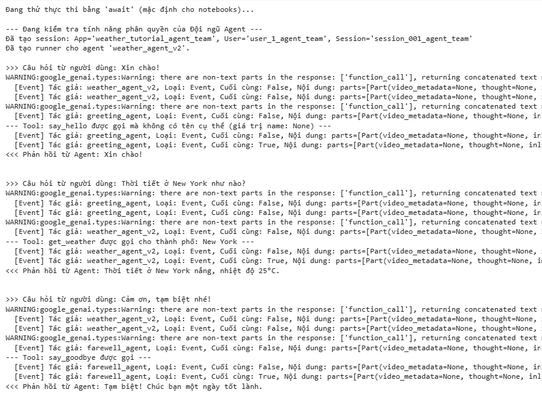

# Xây Dựng Hệ Thống Đa Agent Thông Minh với Google ADK: Weather Bot Đa Tác Nhân (P2)

🌤️ Ở blog P1, mình đã xây dựng một Weather Agent hoạt động tốt với một model cụ thể Gemini. Tuy nhiên, trong các ứng dụng thực tế, việc sử dụng nhiều mô hình LLM mang lại rất nhiều lợi ích:
- **Hiệu suất**: Một số mô hình giỏi về các tác vụ cụ thể (ví dụ: viết code, lập luận logic, sáng tạo)
- **Chi phí**: Giá mỗi mô hình có thể rất khác nhau
- **Khả năng**: Mỗi mô hình có các tính năng, kích thước ngữ cảnh, khả năng fine-tune riêng biệt
- **Tính sẵn sàng & Dự phòng**: Nếu một nhà cung cấp gặp sự cố, vẫn có thể dùng mô hình khác để duy trì hệ thống

## 2. Step 2: Sử dụng nhiều mô hình với LiteLLM 
Trong bước này, mình sẽ học cách:
- Cấu hình một Agent sử dụng mô hình từ các nhà cung cấp như OpenAI (GPT) và Anthropic(Claude) thông qua wrapper LiteLLM
- Tạo và kiểm thử nhiều phiên bản Weather Agent, mỗi phiên bản chạy trên một mô hình khác nhau (mỗi cái có runner và session riêng)
- Tương tác và so sánh kết quả, để xem phản hồi giữa các mô hình khác nhau có gì thay đổi, mặc dù tất cả đều dùng chung một hàm get_weather

**Import LiteLlm**
```
from google.adk.models.lite_llm import LiteLlm
```
LiteLLM là một thư viện Python giúp dễ dàng tích hợp và sử dụng nhiều mô hình ngôn ngữ lớn (LLMs) khác nhau trong cùng một ứng dụng mà không phải lo về chi tiết từng API riêng biêt.

LiteLLM là cầu nối đa mô hình, hỗ trợ gọi các LLM của nhiều nhà cung cấp như Google Gemini, OpenAI GPT, Anthropic Claude... qua một giao diện thống nhất và đơn giản.

**Định nghĩa và kiểm thử các Agent sử dụng nhiều mô hình (Multi-Model)**

🔑 Khái niệm chính: **LiteLlm Wrapper**

Cú pháp LiteLlm(model="provider/model_name") cho ADK biết rằng: Mọi yêu cầu từ agent này sẽ được chuyển qua thư viện LiteLLM, rồi gửi đến nhà cung cấp mô hình tương ứng (ví dụ: OpenAI, Anthropic).

Ta sẽ dùng lại hàm ``call_agent_async`` (đã định nghĩa trước), hàm này nhận ``runner``, ``user_id`` và ``session_id`` để tương tác với agent sau khi setup.

Mỗi đoạn mã dưới đây sẽ thực hiện:
1. Định nghĩa agent mới với một mô hình LiteLLM cụ thể (ví dụ: ``MODEL_GPT_4O`` hoặc ``MODEL_CLAUDE_SONNET``)
2. Tạo mới một ``InMemorySessionService`` và ``session`` riêng cho agent đó giúp lịch sử hội thoại không bị trộn lẫn (độc lập)
3. Tạo runner cho từng agent, dùng session tương ứng
4. Gọi thử ``call_agent_async`` để gửi một câu hỏi và kiểm tra phản hồi từ agent

**Tạo và kiểm tra agent sử dụng GPT-4o của OpenAI**
```
# --- Agent dùng GPT-4o ---
weather_agent_gpt = None  # Khởi tạo biến agent
runner_gpt = None         # Khởi tạo biến runner

try:
    weather_agent_gpt = Agent(
        name="weather_agent_gpt",
        # Điểm khác biệt: Dùng model qua wrapper LiteLLM
        model=LiteLlm(model=MODEL_GPT_4O),
        description="Cung cấp thông tin thời tiết (sử dụng GPT-4o).",
        instruction="Bạn là một trợ lý thời tiết thân thiện, được hỗ trợ bởi GPT-4o. "
                    "Hãy dùng công cụ 'get_weather' để xử lý các yêu cầu liên quan đến thời tiết theo thành phố. "
                    "Hiển thị kết quả rõ ràng nếu thành công hoặc trả lời lịch sự nếu có lỗi từ công cụ.",
        tools=[get_weather],  # Dùng lại công cụ đã định nghĩa
    )
    print(f"Đã tạo agent '{weather_agent_gpt.name}' với mô hình '{MODEL_GPT_4O}'.")

    # InMemorySessionService là dịch vụ lưu trữ đơn giản, không bền vững – phù hợp để demo.
    session_service_gpt = InMemorySessionService()  # Tạo riêng service cho agent này

    # Xác định thông tin định danh cho ngữ cảnh tương tác
    APP_NAME_GPT = "weather_tutorial_app_gpt"
    USER_ID_GPT = "user_1_gpt"
    SESSION_ID_GPT = "session_001_gpt"

    # Tạo session cụ thể cho cuộc trò chuyện này
    session_gpt = await session_service_gpt.create_session(
        app_name=APP_NAME_GPT,
        user_id=USER_ID_GPT,
        session_id=SESSION_ID_GPT
    )
    print(f"Đã tạo session: App='{APP_NAME_GPT}', User='{USER_ID_GPT}', Session='{SESSION_ID_GPT}'")

    # Tạo runner cho agent này
    runner_gpt = Runner(
        agent=weather_agent_gpt,
        app_name=APP_NAME_GPT,
        session_service=session_service_gpt
    )
    print(f"Đã tạo runner cho agent '{runner_gpt.agent.name}'.")

    # --- Kiểm thử agent GPT ---
    print("\n--- Đang kiểm tra agent GPT ---")
    await call_agent_async(query="Thời tiết ở Tokyo như thế nào?",
                           runner=runner_gpt,
                           user_id=USER_ID_GPT,
                           session_id=SESSION_ID_GPT)
    
except Exception as e:
    print(f"❌ Không thể tạo hoặc chạy agent GPT '{MODEL_GPT_4O}'. Kiểm tra lại API Key và tên model. Lỗi: {e}")
```
**Tạo và kiểm tra agent sử dụng mô hình Claude Sonnet của Anthropicss**
```
# --- Agent sử dụng Claude Sonnet ---
weather_agent_claude = None  # Khởi tạo giá trị None
runner_claude = None         # Khởi tạo runner

try:
    weather_agent_claude = Agent(
        name="weather_agent_claude",
        # Điểm khác biệt: sử dụng LiteLLM để wrap model Claude
        model=LiteLlm(model=MODEL_CLAUDE_SONNET),
        description="Cung cấp thông tin thời tiết (sử dụng Claude Sonnet).",
        instruction="Bạn là một trợ lý thời tiết thân thiện, được hỗ trợ bởi Claude Sonnet. "
                    "Sử dụng công cụ 'get_weather' để xử lý yêu cầu thời tiết theo thành phố. "
                    "Phân tích output dạng từ điển từ tool (gồm 'status', 'report' hoặc 'error_message'). "
                    "Trình bày kết quả nếu thành công, hoặc báo lỗi một cách lịch sự nếu có.",
        tools=[get_weather],  # Dùng lại tool đã định nghĩa
    )
    print(f"Đã tạo agent '{weather_agent_claude.name}' với model '{MODEL_CLAUDE_SONNET}'.")

    # InMemorySessionService là dạng lưu trữ đơn giản, không bền vững – phù hợp để demo.
    session_service_claude = InMemorySessionService()  # Tạo riêng cho agent Claude

    # Xác định thông tin định danh cho ngữ cảnh tương tác
    APP_NAME_CLAUDE = "weather_tutorial_app_claude"
    USER_ID_CLAUDE = "user_1_claude"
    SESSION_ID_CLAUDE = "session_001_claude"

    # Tạo session cho cuộc trò chuyện này
    session_claude = await session_service_claude.create_session(
        app_name=APP_NAME_CLAUDE,
        user_id=USER_ID_CLAUDE,
        session_id=SESSION_ID_CLAUDE
    )
    print(f"Đã tạo session: App='{APP_NAME_CLAUDE}', User='{USER_ID_CLAUDE}', Session='{SESSION_ID_CLAUDE}'")

    # Tạo runner cho agent này
    runner_claude = Runner(
        agent=weather_agent_claude,
        app_name=APP_NAME_CLAUDE,
        session_service=session_service_claude
    )
    print(f"Đã tạo runner cho agent '{runner_claude.agent.name}'.")

    # --- Kiểm thử Agent Claude ---
    print("\n--- Đang kiểm tra agent Claude ---")
    await call_agent_async(query="Weather in London please.",
                           runner=runner_claude,
                           user_id=USER_ID_CLAUDE,
                           session_id=SESSION_ID_CLAUDE)

except Exception as e:
    print(f"❌ Không thể tạo hoặc chạy Claude agent '{MODEL_CLAUDE_SONNET}'. Kiểm tra lại API Key và tên model. Lỗi: {e}")
```
## 3. Step 3: Xây dựng một nhóm Agent - Phân quyền cho Lời chào và Tạm biệt

Ở bước 1 và 2, chúng ta đã xây dựng và thử nghiệm một agent duy nhất tập trung vào việc tra cứu thời tiết. Mặc dù hiệu quả với nhiệm vụ cụ thể, nhưng trong các ứng dụng thực tế, người dùng có thể yêu cầu nhiều dạng tương tác khác nhau. Chúng ta có thể tiếp tục thêm nhiều công cụ và hướng dẫn phức tạp vào agent thời tiết ban đầu, nhưng cách làm này sẽ nhanh chóng trở nên khó quản lý và kém hiệu quả.

Một cách tiếp cận linh hoạt hơn là xây dựng một Nhóm Agent (Agent Team).
1. Tạo nhiều agent riêng biệt, mỗi agent phục vụ cho một năng lực cụ thể (ví dụ: một agent cho thời tiết, một agent cho lời chào, một agent cho tính toán, v.v.)
2. Chỉ định một agent gốc (root) - còn gọi là orchestraor để nhận yêu cầu ban đầu từ người dùng
3. Cho phép agent gốc phân quyền (delegate) yêu cầu đến các sub-agent phù hợp dựa trên mục đích của người dùng

❓ Tại sao lại cần xây dựng một Nhóm Agent?
- Tính mô-đun: Dễ phát triển, thử nghiệm và bảo trì từng agent riêng biệt.
- Tính chuyên biệt: Mỗi agent có thể được tinh chỉnh (hướng dẫn, chọn model) phù hợp với nhiệm vụ cụ thể.
- Tính mở rộng: Dễ dàng thêm chức năng mới chỉ bằng cách thêm agent mới.
- Hiệu quả chi phí: Có thể sử dụng model đơn giản/giá rẻ hơn cho các tác vụ đơn giản (như lời chào).

✅ Trong bước này, mình sẽ:
1. Định nghĩa các công cụ đơn giản để xử lý lời chào (say_hello) và tạm biệt (say_goodbye).
2. Tạo 2 agent phụ chuyên biệt mới: greeting_agent và farewell_agent.
3. Cập nhật agent thời tiết chính thành agent gốc (weather_agent_v2).
4. Cấu hình agent gốc với danh sách các sub-agent để hỗ trợ phân quyền tự động.
5. Thử nghiệm luồng phân quyền bằng cách gửi các loại yêu cầu khác nhau cho agent gốc.

**Định nghĩa các Tool cho các Agent phụ**

Trước tiên, chúng ta sẽ tạo các hàm Python đơn giản đóng vai trò là tool cho các agent chuyên biệt mới.
```
from typing import Optional 


def say_hello(name: Optional[str] = None) -> str:
    """Trả về một lời chào đơn giản. Nếu có tên, lời chào sẽ bao gồm tên.

    Args:
        name (str, optional): Tên người cần chào. Mặc định sẽ dùng lời chào chung nếu không truyền tên.

    Returns:
        str: Câu chào thân thiện.
    """
    if name:
        greeting = f"Xin chào, {name}!"
        print(f"--- Tool: say_hello được gọi với tên: {name} ---")
    else:
        greeting = "Xin chào!"
        print(f"--- Tool: say_hello được gọi mà không có tên cụ thể (giá trị name: {name}) ---")
    return greeting

def say_goodbye() -> str:
    """Trả về một câu chào tạm biệt đơn giản để kết thúc cuộc hội thoại."""
    print(f"--- Tool: say_goodbye được gọi ---")
    return "Tạm biệt! Chúc bạn một ngày tốt lành."
```
**Định nghĩa các Sub-Agent (Chào hỏi & Tạm biệt)**

Bây giờ, ta sẽ tạo các agent chuyên trách cho từng nhiệm vụ cụ thể.

*Lưu ý:* Cần chú ý đến phần mô tả (description) vì agent gốc sẽ dựa vào đó để quyết định có nên ủy quyền cho câu hỏi cho sub-agent hay không.

**Nên:**
- Trường description nên ngắn gọn, rõ ràng và thể hiện đúng khả năng chuyên môn của sub-agent.
- Trường instruction nên được viết rõ ràng, giới hạn phạm vi nhiệm vụ của agent (ví dụ: “Nhiệm vụ duy nhất của bạn là…”).

**Định nghĩa Greeting Agent (Agent Chào hỏi)**
```
greeting_agent = None
try:
    greeting_agent = Agent(
        model = MODEL_GEMINI_2_0_FLASH,  # Dùng model đơn giản vì nhiệm vụ nhẹ
        name="greeting_agent",
        instruction="Bạn là Greeting Agent. NHIỆM VỤ DUY NHẤT của bạn là gửi lời chào thân thiện đến người dùng. "
                    "Hãy dùng công cụ 'say_hello' để tạo lời chào. "
                    "Nếu người dùng cung cấp tên, hãy truyền tên đó cho công cụ. "
                    "Không thực hiện bất kỳ tác vụ nào khác.",
        description="Xử lý lời chào đơn giản và chào hỏi bằng công cụ 'say_hello'.", # Cực kỳ quan trọng cho việc phân quyền
        tools=[say_hello],
    )
    print(f"✅ Agent '{greeting_agent.name}' đã được tạo với model '{greeting_agent.model}'.")
except Exception as e:
    print(f"❌ Không thể tạo Greeting Agent. Kiểm tra API Key ({greeting_agent.model}). Lỗi: {e}")
```
**Định nghĩa Farewell Agent (Agent Tạm biệt)**
```
farewell_agent = None
try:
    farewell_agent = Agent(
        model = MODEL_GEMINI_2_0_FLASH,  
        name="farewell_agent",
        instruction="Bạn là Farewell Agent. NHIỆM VỤ DUY NHẤT của bạn là gửi lời tạm biệt lịch sự. "
                    "Hãy dùng công cụ 'say_goodbye' khi người dùng thể hiện ý định rời đi hoặc kết thúc cuộc hội thoại "
                    "(ví dụ như dùng các từ: 'bye', 'goodbye', 'cảm ơn tạm biệt', 'hẹn gặp lại'). "
                    "Không thực hiện bất kỳ hành động nào khác.",
        description="Xử lý lời tạm biệt đơn giản bằng công cụ 'say_goodbye'.", # Quan trọng để agent gốc hiểu phân công
        tools=[say_goodbye],
    )
    print(f"✅ Agent '{farewell_agent.name}' đã được tạo với model '{farewell_agent.model}'.")
except Exception as e:
    print(f"❌ Không thể tạo Farewell Agent. Kiểm tra API Key ({farewell_agent.model}). Lỗi: {e}")
```
**Định nghĩa Agent gốc (Weather Agent v2) với các Sub-Agent**

Bây giờ, chúng ta sẽ nâng cấp `weather_agent`. Những thay đổi chính bao gồm:
- Thêm tham số `sub_agents`: Chúng ta truyền vào một danh sách chứa các instance của `greeting_agent` và `farewell_agent` mà ta đã tạo trước đó.
- Cập nhật `instruction`: Cần hướng dẫn rõ ràng cho agent gốc biết về các sub-agent và khi nào cần ủy nhiệm công việc cho chúng.

🔑 Khái niệm quan trọng: Automatic Delegation (Ủy quyền tự động)
Khi cung cấp danh sách sub_agents, ADK sẽ kích hoạt tính năng tự động ủy quyền. Khi agent gốc nhận được câu hỏi từ người dùng, LLM sẽ:
- Xem xét chính nó có thể xử lý không
- Đánh giá phần mô tả (description) của mỗi sub-agent
- Và nếu thấy phù hợp hơn, nó sẽ tự động chuyển quyền xử lý sang sub-agent thông qua một hành động nội bộ đặc biệt

➡️ Sub-agent sẽ xử lý yêu cầu bằng mô hình, hướng dẫn và công cụ riêng của nó.

```
root_agent = None
runner_root = None  

if greeting_agent and farewell_agent and 'get_weather' in globals():
    # Sử dụng mô hình Gemini mạnh để điều phối
    root_agent_model = MODEL_GEMINI_2_0_FLASH

    weather_agent_team = Agent(
        name="weather_agent_v2",  # Đặt tên phiên bản mới
        model=root_agent_model,
        description="Agent điều phối chính. Xử lý yêu cầu thời tiết và ủy quyền lời chào/tạm biệt cho các agent chuyên biệt.",
        instruction="Bạn là Weather Agent chính, phụ trách điều phối một nhóm agent. Nhiệm vụ chính của bạn là cung cấp thông tin thời tiết. "
                    "Chỉ sử dụng công cụ 'get_weather' cho các yêu cầu liên quan đến thời tiết (ví dụ: 'thời tiết ở London'). "
                    "Bạn có các agent chuyên biệt như sau: "
                    "1. 'greeting_agent': Xử lý lời chào đơn giản như 'Hi', 'Hello'. Hãy ủy quyền cho nó khi gặp các tình huống này. "
                    "2. 'farewell_agent': Xử lý lời tạm biệt đơn giản như 'Bye', 'See you'. Hãy ủy quyền cho nó khi gặp các tình huống này. "
                    "Phân tích câu hỏi người dùng. Nếu là lời chào, hãy ủy quyền cho 'greeting_agent'. Nếu là lời tạm biệt, hãy ủy quyền cho 'farewell_agent'. "
                    "Nếu là yêu cầu thời tiết, bạn tự xử lý bằng 'get_weather'. "
                    "Với các trường hợp khác, hãy phản hồi phù hợp hoặc thông báo rằng bạn không thể xử lý.",
        tools=[get_weather],  # Agent gốc vẫn cần tool thời tiết để xử lý
        sub_agents=[greeting_agent, farewell_agent]  
    )
    print(f"✅ Đã tạo Root Agent '{weather_agent_team.name}' sử dụng mô hình '{root_agent_model}' với các sub-agent: {[sa.name for sa in weather_agent_team.sub_agents]}")
else:
    print("❌ Không thể tạo root agent vì thiếu sub-agent hoặc hàm 'get_weather'.")
    if not greeting_agent: print(" - Thiếu Greeting Agent.")
    if not farewell_agent: print(" - Thiếu Farewell Agent.")
    if 'get_weather' not in globals(): print(" - Thiếu hàm get_weather.")
```

**Tương tác với nhóm Agent**

Tiếp theo ta sẽ:
1. Định nghĩa một hàm async tên là `run_team_conversation`.
2. Trong hàm này:
   - Tạo một InMemorySessionService mới dành riêng cho bài test này.
   - Tạo một session riêng biệt với ID là "session_001_agent_team" để lịch sử hội thoại không bị trộn với các bước trước.
3. Tạo một Runner cấu hình để sử dụng weather_agent_team (agent gốc) và session service vừa tạo.
4. Gửi 3 truy vấn khác nhau (lời chào, hỏi thời tiết, lời tạm biệt) tới runner này bằng cách sử dụng hàm call_agent_async đã định nghĩa ở các bước trước.

Kỳ vọng hoạt động:

| Câu hỏi người dùng                 | Ai xử lý?                  | Tool được gọi |
| ---------------------------------- | -------------------------- | ------------- |
| `Hello there!`                     | `greeting_agent`           | `say_hello`   |
| `What is the weather in New York?` | `weather_agent_team` (gốc) | `get_weather` |
| `Thanks, bye!`                     | `farewell_agent`           | `say_goodbye` |

**Kết quả thực thi**
<p align="center">

</p>

---

<p align="center">
**Võ Nhất Phương** hoàn thành✨✨✨
</p>

