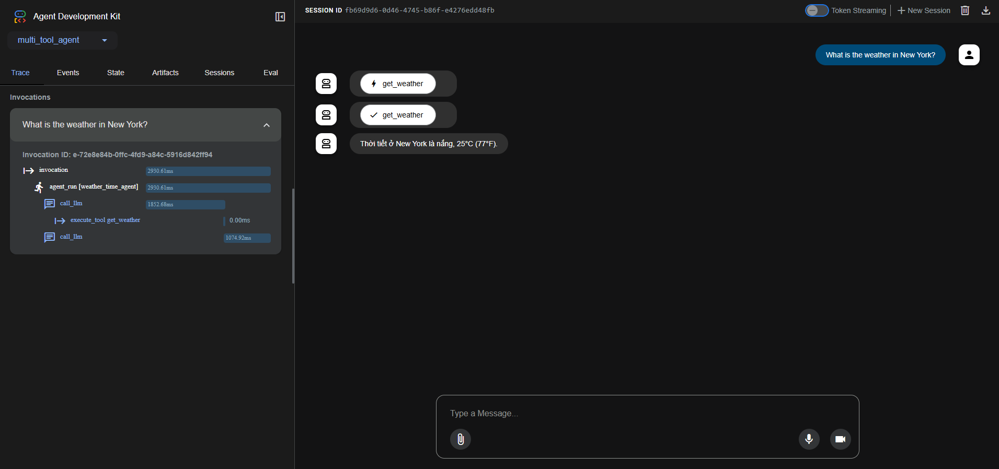
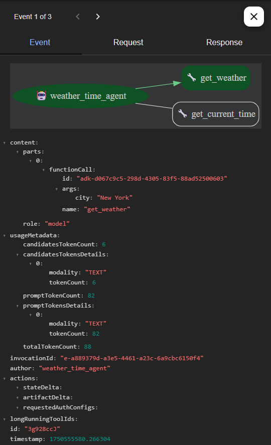
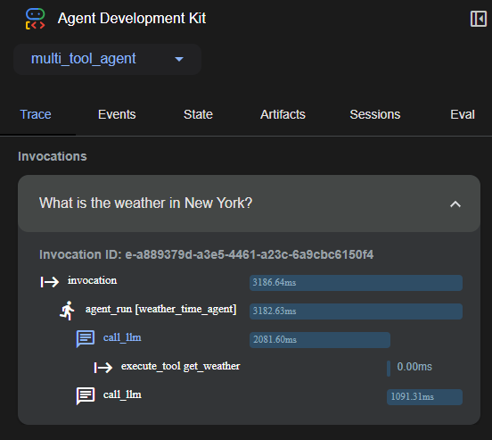

# Tìm Hiểu Về Agent Development Kit (ADK) - Công Cụ Mới Của Google
<p align="justify">
Agent Development Kit (ADK) là một bộ công cụ mã nguồn mở mới do Google phát triển. Công cụ này nhằm hỗ trợ xây dựng các AI agent tự động có khả năng sử dụng công cụ (tool), phối hợp đa tác nhân (multi-agent), ghi nhớ phiên làm việc và tương tác với các mô hình ngôn ngữ lớn (LLM) như Gemini, GPT-4, Claude,...

## 1. Tính năng nổi bật của ADK

- Dễ tích hợp LLM thông qua LiteLLM (hỗ trợ nhiều mô hình khác nhau)
- Định nghĩa tool dễ dàng: cho phpes agent gọi các hàm Python để thực hiện nhiệm vụ cụ thể
- Orchestrator mạnh mẽ: giúp điều phối nhiều agent làm việc cùng nhau
- Có thể chạy cục bộ trên terminal hoặc trình duyệt qua Dev UI
- Tích hợp session, memory: agent nhớ được thông tin xuyên suốt cuộc trò chuyện
- Callback API: kiểm soát hành vi agent để đảm bảo an toàn & kiểm duyệt

## 2. Các ví dụ use case tiêu biểu của ADK
- Bot thời tiết thông minh có thể phối hợp nhiều agent và tool
- Trợ lý học tập AI nhớ được lịch sử làm việc với sinh viên
- Hệ thống customer support tự động phân tích vấn đề và gọi tool phù hợp
## 3. Quick start với Bot thời tiết thông minh
- Cài đặt môi trường & ADK với Python
```
python -m venv .venv
.venv\Scripts\Activate.ps1

pip install google-adk
```
- Tạo dự án Agent

Cấu trúc dự án:
```
parent_folder/
    multi_tool_agent/
        __init__.py
        agent.py
        .env
```
Tạo thư mục multi_tool_agent

Tạo file __init__.py:
```
from . import agent
```
Tạo file agent.py:
```
import datetime
from zoneinfo import ZoneInfo
from google.adk.agents import Agent

def get_weather(city: str) -> dict:
    if city.lower() == "new york":
        return {
            "status": "success",
            "report": "Thời tiết ở New York là nắng, 25°C (77°F)."
        }
    else:
        return {
            "status": "error",
            "error_message": f"Không có thông tin thời tiết cho '{city}'."
        }

def get_current_time(city: str) -> dict:
    if city.lower() == "new york":
        tz_identifier = "America/New_York"
    else:
        return {
            "status": "error",
            "error_message": f"Xin lỗi, không có thông tin múi giờ cho {city}."
        }

    tz = ZoneInfo(tz_identifier)
    now = datetime.datetime.now(tz)
    report = f"Giờ hiện tại ở {city} là {now.strftime('%Y-%m-%d %H:%M:%S %Z%z')}"
    return {"status": "success", "report": report}

root_agent = Agent(
    name="weather_time_agent",
    model="gemini-2.0-flash",
    description="Trợ lý trả lời câu hỏi về thời tiết và thời gian.",
    instruction="Bạn là một trợ lý hữu ích có thể trả lời câu hỏi về thời tiết và thời gian.",
    tools=[get_weather, get_current_time],
)
```
Tạo file .env:
```
GOOGLE_GENAI_USE_VERTEXAI=FALSE
GOOGLE_API_KEY=PASTE_YOUR_ACTUAL_API_KEY_HERE
```
- Cấu hình mô hình ngôn ngữ LLM

Lấy API Key tại [Google AI Studio](https://aistudio.google.com/app/apikey)
- Chạy Agent
```
cd parent_folder/
```
```
adk web
```
Nếu bị lỗi _make_subprocess_transport NotImplementedError (Windows hay gặp):
```
adk web --no-reload
```
Mở trình duyệt: http://localhost:8000
Trong giao diện Dev UI, chọn agent "multi_tool_agent" ở góc trái.
Gõ câu hỏi như:
```
What is the weather in New York?
What is the time in New York?
```
<p align="center">

</p>
Mở tab Events để xem quá trình agent gọi hàm
<p align="center">

</p>
Xem tab Trace để theo dõi tốc độ thực thi
<p align="center">

</p>
Nếu bạn muốn nói chuyện bằng giọng nói, đổi dòng model=... trong agent.py thành model hỗ trợ Gemini Live:
```
model="gemini-2.0-flash-live-001"
```
</p>
---

<p align="center">
**Võ Nhất Phương** hoàn thành✨✨✨
</p>

